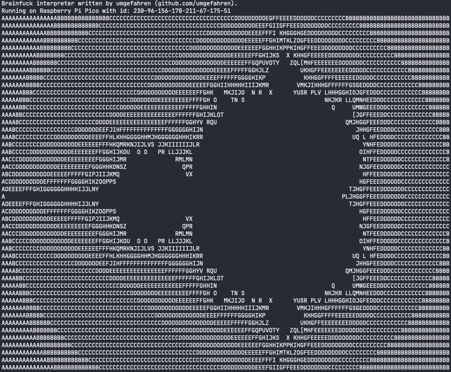

# Brainfuck on Pico

An implementation of a Brainfuck interpreter build for the Raspberry Pico (maybe also other RP2040 but not tested).

## Screenshot

## Compilation
 - Make sure you have the Raspberry Pi Pico C/C++ SDK
 - Clone this repository with `git clone https://github.com/umgefahren/BrainfuckOnPico`
 - Cd into the new directory `cd BrainfuckOnPico`
 - Create the build directory `mkdir build`
 - Run CMake `cmake ..`
 - Build `make`
 - Copy the file with the .uf2 file ending into the plugged in Raspberry Pico
 - Open minicom or something similar to observe the output.

## Run your own code.

- To run your own code, copy the contents of your code into the mandelbrot.bf file.
- Run: `xxd -i mandelbrot.bf mandelbrot.h`
- Recompile
- Flash